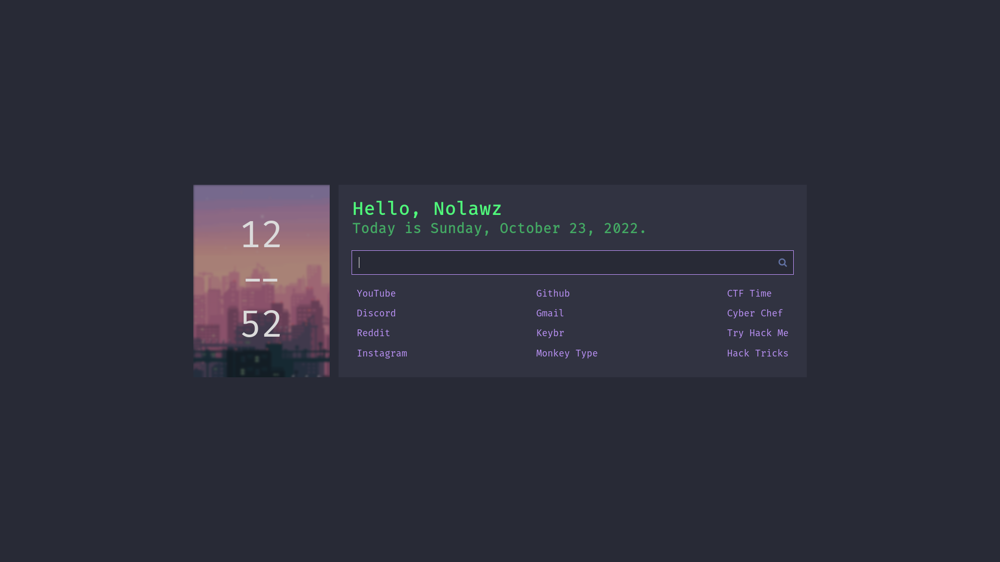
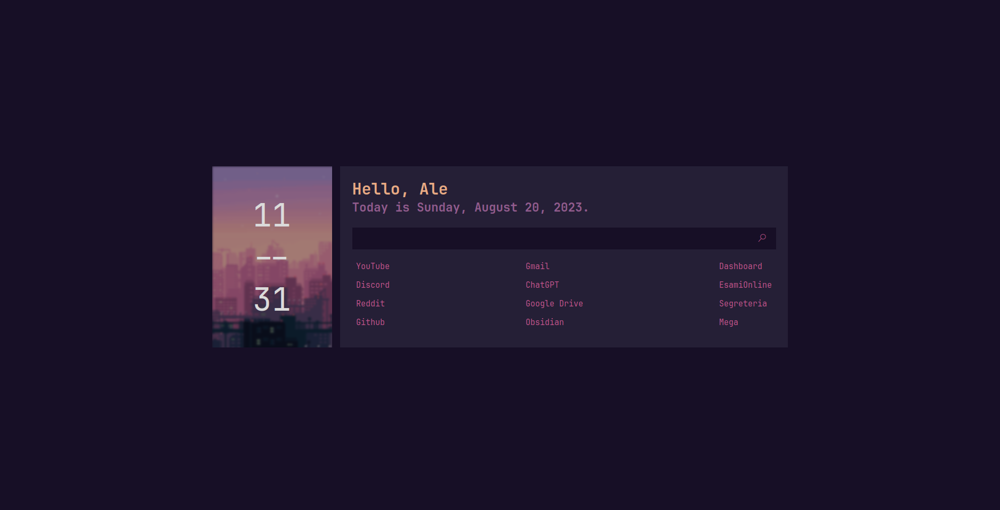

# Startpage

Dracula theme (forked):

Kanagawa theme (custom made):


When I want to switch themes, I simply rename the HTML file I want to be my current theme to `index.html` and give the others different names, since Firefox is setup to always open `index.html` file as startup page.

# Settings

Press `s` to open settings.

# Firefox

## Setting the startpage as the Home page

1. Copy the startpage dir to ~/.mozilla/firefox/PROFILE/ (You can find your profile by going to `about:profiles`)
2. Open `index.html` in Firefox and copy the link in address bar. It would loook like: `file:///home/<username>/.mozilla/firefox/<PROFILE>/startpage/index.html`
3. Open preferences > Home from the hamburger menu, select custom URLs and paste the address
4. Restart Firefox

## Setting the startpage as the New Tab page

1. Write the following lines to `/usr/lib/firefox/mozilla.cfg` (Create it if it doesn't exist). And change the `var newTabUrl = ...`.

```javascript
//
var { classes: Cc, interfaces: Ci, utils: Cu } = Components;

/* set new tab page */
try {
  Cu.import("resource:///modules/AboutNewTab.jsm");
  var newTabURL = "file:///home/<username>/.mozilla/firefox/<profile>/startpage/index.html";
  AboutNewTab.newTabURL = newTabURL;
} catch (e) {
  Cu.reportError(e);
} // report errors in the Browser Console
```

2. Write the following lines to `/usr/lib/firefox/defaults/pref/local-settings.js`:

```javascript
//
pref("general.config.filename", "mozilla.cfg");
pref("general.config.obscure_value", 0);
pref("general.config.sandbox_enabled", false);
```

3. Restart Firefox
